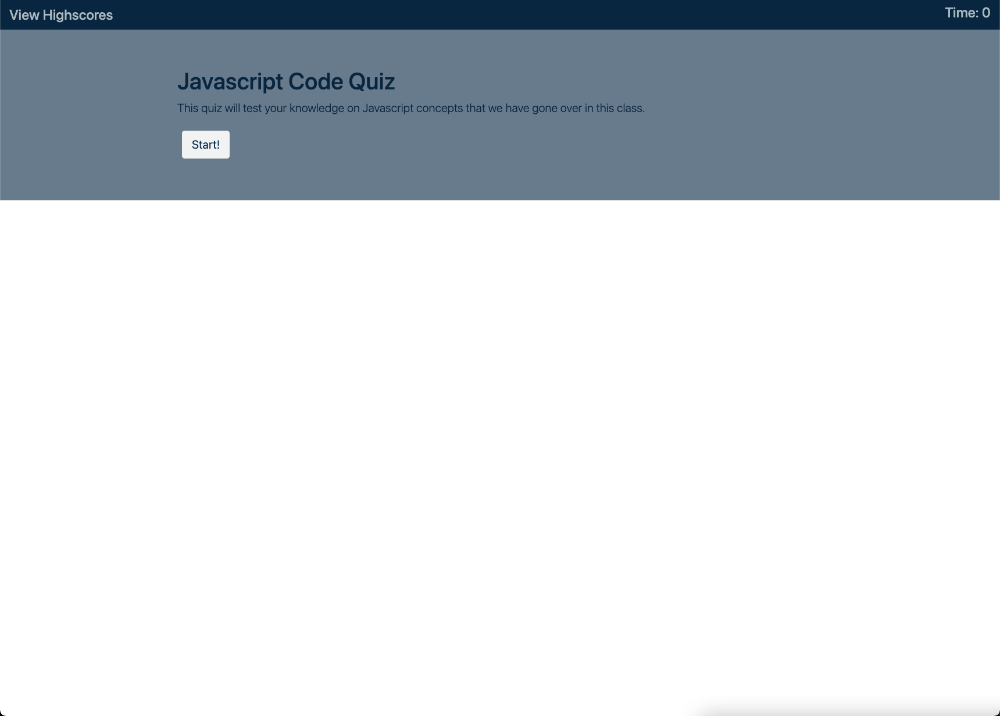

# Javascript Quiz

## Description
The objective of this project was to simulate a coding assessment given by a company during the interview process. This project tasked me with creating a timed coding quiz with multiple-choice questions. This app rusn in the browser and features dynamically updated HTML and CSS powered by JavaScript code.

This app is a multiple choice quiz based on JavaScript. Once the user presses the start button then the quiz will begin and the questions will populate the jumbotron. Once the user completes the quiz, then they can submit their score and name to be placed in the highscore leaderboard, accessed via the top left link. The timer in the top right corner will also start from 30 seconds. In creating this project, I utilized the bootstrap API for layouts and design. In the future, I can revise this project and revamp the UI to my liking. For now, I focused on the functionality of the app.

[Deployed Application](https://reginaldcapanzana.github.io/code-quiz/)